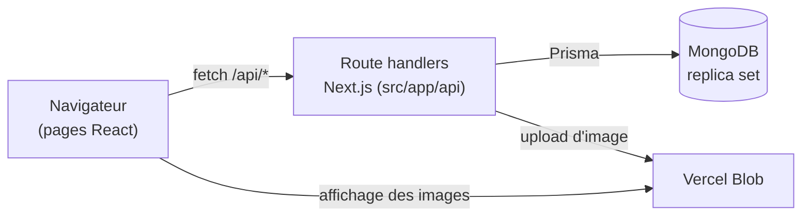

<p align="center">
  
</p>

<h1 align="center">Pattes Douces</h1>

<p align="center">
  <strong>Le blog communautaire des amoureux des chats</strong><br>
  Publiez vos articles, réagissez et commentez ceux des autres, suivez vos statistiques.
</p>

<p align="center">
  <a href="https://github.com/Alexandre-git-SDV/Projet-Blog-Pattes-Douces/actions/workflows/build.yml"></a>
  
  
  
  
  
  
  
</p>

---

## Sommaire

- [À propos](#à-propos)
- [Fonctionnalités](#fonctionnalités)
- [Stack technique](#stack-technique)
- [Installation locale](#installation-locale)
  - [Prérequis](#prérequis)
  - [Option A : avec pnpm](#option-a--avec-pnpm)
  - [Option B : tout dans Docker](#option-b--tout-dans-docker)
  - [Variables d'environnement](#variables-denvironnement)
- [Scripts disponibles](#scripts-disponibles)
- [Architecture](#architecture)
- [Sécurité](#sécurité)
- [Dépannage](#dépannage)
- [Qualité et CI](#qualité-et-ci)
- [Licence](#licence)

---

## À propos

**Pattes Douces** est un blog communautaire consacré aux chats. Chaque membre
peut publier des articles illustrés, réagir (like / dislike) et commenter ceux
des autres, puis suivre l'audience de ses publications depuis un tableau de bord.

L'application est construite avec **Next.js 16** (App Router) : l'interface et
l'API REST vivent dans le même projet, les données sont stockées dans
**MongoDB** via l'ORM **Prisma**, et les images d'articles sont hébergées sur
**Vercel Blob**.

> Le code de l'application se trouve dans [`blog-pattes-douces/`](blog-pattes-douces/).
> La référence technique détaillée (API, modèle de données, contraintes de
> versions) est dans [`blog-pattes-douces/README.md`](blog-pattes-douces/README.md).

## Fonctionnalités

| | Fonctionnalité | Page |
|---|---|---|
| 🔐 | **Inscription et connexion** (mot de passe fort exigé, hashé avec bcrypt) | `/register`, `/login` |
| 📰 | **Fil d'actualité** : tous les articles, du plus récent au plus ancien | `/feed` |
| 📖 | **Lecture d'un article** : vues, likes / dislikes, commentaires | `/articles/[id]` |
| ✍️ | **Publication** d'un article avec image | `/articles/new` |
| 🗂️ | **Mes articles** : liste et suppression | `/my-articles` |
| 📊 | **Tableau de bord** : vues, réactions, commentaires reçus, graphiques | `/dashboard` |
| 🕘 | **Activité** : mes articles, mes commentaires, les articles que j'ai aimés | `/activity` |
| 💬 | **Mes commentaires** | `/comments` |
| 👤 | **Profil** : statistiques, déconnexion, suppression du compte | `/profile` |

## Stack technique

| Domaine | Technologie |
|---|---|
| Framework | [Next.js 16](https://nextjs.org) — App Router, Turbopack, route handlers |
| Interface | [React 19](https://react.dev), [Tailwind CSS 4](https://tailwindcss.com), [Heroicons](https://heroicons.com) |
| Base de données | [MongoDB 8.0](https://www.mongodb.com) (replica set) via [Prisma 6](https://www.prisma.io) |
| Images | [Vercel Blob](https://vercel.com/docs/storage/vercel-blob) |
| Langage | TypeScript 6 (mode strict) |
| Outillage | pnpm 10, ESLint 10, Docker / Docker Compose, GitHub Actions |

## Installation locale

Deux méthodes au choix :

| | Option A : pnpm | Option B : Docker |
|---|---|---|
| **Pour qui** | Développer (rechargement à chaud) | Lancer l'application sans rien installer d'autre que Docker |
| **Application** | `pnpm dev` sur votre machine | Conteneur (build de production) |
| **Base MongoDB** | Conteneur Docker ou MongoDB Atlas | Conteneur Docker |

### Prérequis

| Outil | Version | Option A | Option B | Vérifier |
|---|---|:---:|:---:|---|
| [Git](https://git-scm.com) | récente | ✅ | ✅ | `git --version` |
| [Docker](https://docs.docker.com/get-docker/) + Compose | récente | ✅ ¹ | ✅ | `docker compose version` |
| [Node.js](https://nodejs.org) | 24 LTS | ✅ | — | `node -v` |
| [pnpm](https://pnpm.io) | 10 | ✅ | — | `pnpm -v` |

¹ Pour la base locale uniquement ; inutile avec une base [MongoDB Atlas](https://www.mongodb.com/atlas).
pnpm s'installe avec `corepack enable` (fourni avec Node.js), qui utilise
automatiquement la version fixée dans `package.json`.

Pour commencer, récupérez le projet :

```bash
git clone https://github.com/Alexandre-git-SDV/Projet-Blog-Pattes-Douces.git
cd Projet-Blog-Pattes-Douces/blog-pattes-douces
cp .env.example .env
```

### Option A : avec pnpm

```bash
pnpm install    # 1. dépendances (génère aussi le client Prisma)
pnpm db:up      # 2. démarre MongoDB en replica set (Docker) et attend qu'il soit prêt
pnpm db:push    # 3. crée les index de la base (pseudo et email uniques)
pnpm dev        # 4. serveur de développement
```

L'application est disponible sur **http://localhost:3000**.
Pour arrêter la base : `pnpm db:down` (les données sont conservées).

> **Avec MongoDB Atlas** à la place de Docker : sautez l'étape 2 et remplacez
> `DATABASE_URL` dans `.env` par la chaîne de connexion Atlas (déjà en replica set).

### Option B : tout dans Docker

```bash
docker compose --profile app up -d --build --wait    # ou : pnpm docker:up
```

Cette commande construit l'image de l'application puis démarre trois services :

| Service | Rôle |
|---|---|
| `mongo` | MongoDB 8.0 en replica set, données persistées dans un volume |
| `db-init` | Crée les index de la base, puis s'arrête |
| `app` | L'application (build de production Next.js), sur **http://localhost:3000** |

`--wait` rend la main quand l'application répond. Pour tout arrêter :
`docker compose --profile app down` (ajouter `-v` pour effacer aussi les données).

### Variables d'environnement

Elles se définissent dans `.env` (copié depuis [`.env.example`](blog-pattes-douces/.env.example)).
**Ce fichier n'est jamais commité** : il est ignoré par git.

| Variable | Obligatoire | Description |
|---|---|---|
| `DATABASE_URL` | Option A | Connexion MongoDB. La valeur par défaut pointe sur la base Docker locale. En option B, `compose.yaml` la fournit à l'application. |
| `BLOB_READ_WRITE_TOKEN` | Pour publier | Jeton Vercel Blob (*Storage > Blob > Tokens*). Sans lui, tout fonctionne sauf la publication d'un article, dont l'image est obligatoire. |

Ports déjà utilisés ? Préfixez les commandes Docker avec `MONGO_PORT=27019`
et/ou `APP_PORT=3005` (pensez alors à adapter `DATABASE_URL` en option A).

## Scripts disponibles

À lancer depuis `blog-pattes-douces/` :

| Commande | Effet |
|---|---|
| `pnpm dev` | Serveur de développement avec rechargement à chaud |
| `pnpm build` / `pnpm start` | Build de production / lancement du build |
| `pnpm lint` | Analyse ESLint |
| `pnpm typecheck` | Vérification TypeScript (types de routes inclus) |
| `pnpm db:up` / `pnpm db:down` | Démarre / arrête MongoDB (Docker) |
| `pnpm db:push` | Synchronise les index de la base avec le schéma Prisma |
| `pnpm docker:up` / `pnpm docker:down` | Démarre / arrête toute l'application dans Docker |

## Architecture



```
blog-pattes-douces/
├── prisma/schema.prisma    Modèle de données (User, Article, Commentaire)
├── public/images/          Logo et images statiques
├── src/
│   ├── app/                Routage : pages, layouts, API REST (app/api)
│   ├── features/           Code métier par fonctionnalité (auth, articles, dashboard...)
│   ├── components/layout/  Gabarit commun : en-tête, barre latérale, pied de page
│   ├── lib/                Prisma, validation, client API, routes, session
│   └── types/              Types partagés
├── compose.yaml            MongoDB + application (Docker)
└── Dockerfile              Image de production
```

Les pages de `src/app/` restent de simples points d'entrée (Server Components) ;
toute la logique interactive vit dans `src/features/`. Le détail des routes
d'API et du modèle de données est dans la
[référence technique](blog-pattes-douces/README.md).

## Sécurité

- Les réponses de l'API n'exposent jamais le hash du mot de passe ni l'email.
- Toutes les entrées sont validées côté serveur ; une entrée invalide renvoie 400 ou 404.
- La connexion ne révèle pas si un pseudo existe.
- Upload limité aux images (JPEG, PNG, WebP, GIF) de 4 Mo maximum.
- En-têtes HTTP de sécurité, secrets hors du dépôt, dépendances surveillées.

> [!WARNING]
> **Limite connue :** l'identité de l'utilisateur est conservée dans le
> navigateur (`localStorage`) et n'est pas vérifiée par le serveur. Une
> véritable session (cookie `httpOnly`) est nécessaire avant toute mise en
> production. Détails dans la [référence technique](blog-pattes-douces/README.md#sécurité).

## Dépannage

<details>
<summary><b>« Prisma needs to perform transactions, which requires your MongoDB server to be run as a replica set »</b></summary>

`DATABASE_URL` pointe vers un MongoDB lancé sans replica set. Utilisez
`pnpm db:up` et l'URL fournie dans `.env.example`, ou une base Atlas.
</details>

<details>
<summary><b>Le port 27017 ou 3000 est déjà utilisé</b></summary>

Un autre service occupe le port. Lancez par exemple
`MONGO_PORT=27019 pnpm db:up` et mettez `localhost:27019` dans `DATABASE_URL`,
ou `APP_PORT=3005 pnpm docker:up` pour l'application.
</details>

<details>
<summary><b>« L'upload d'images n'est pas configuré » à la publication</b></summary>

Renseignez `BLOB_READ_WRITE_TOKEN` dans `.env`, puis redémarrez
(`pnpm dev`, ou `pnpm docker:up` en option B).
</details>

<details>
<summary><b>« Another next dev server is already running »</b></summary>

Un `pnpm dev` tourne déjà dans ce dossier : utilisez l'URL qu'il affiche ou
arrêtez-le avant d'en lancer un autre.
</details>

<details>
<summary><b>J'ai oublié <code>pnpm db:push</code></b></summary>

L'application fonctionne, mais la base ne garantit plus l'unicité du pseudo et
de l'email. Lancez-le après chaque création de base.
</details>

## Qualité et CI

Chaque push et pull request vers `main` ou `development` déclenche :

| Workflow | Vérifications |
|---|---|
| **Build** | Installation, schéma Prisma, ESLint, TypeScript, build Next.js, construction de l'image Docker |
| **CodeQL** | Analyse de sécurité du code JavaScript / TypeScript et des workflows |
| **Actions & CI Files** | Lint des workflows (actionlint) et audit de sécurité (zizmor) |

[Dependabot](.github/dependabot.yml) propose chaque semaine les mises à jour
des dépendances npm, des actions GitHub et de l'image Docker, avec un délai
de 7 jours après chaque publication.

## Licence

Ce projet est distribué sous licence **MIT**.
